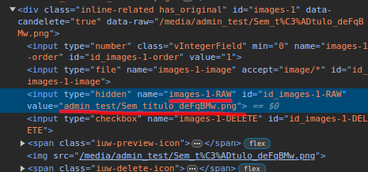

# Prevent Raw Images Path Change

Like various other `multiple` instances or values support, we have an tiny problem at this component, for now: when we save a form with some "unchanged" values, i.e., with the current file path string instead of an uploaded file, this string is used to store in the database. Is planed, in the future, change this to use the original array values to confirm the sended values. But, for this first version, this is a issue that is not resolved.

Example of how this works: navigate to widget change, and find for the hidden input with `-RAW` name. Change the value to another and saves. The wrong value is correctly saved.

<div class="images-container" markdown="block">



</div>

## How to prevent this behaviour?

One of the way to prevent this behaviour is create a custom `ModelForm` and raises a `ValidationError` for string values that is not present on the original value. See a example:

```python
from django import forms
from django.core.exceptions import ValidationError


class TestWithArrayFieldForm(forms.ModelForm):
    old_values = []

    def map_is_valid_images(self, value):
        if not isinstance(value, str):
            return False
        return value not in self.old_values

    def clean(self):
        data = super().clean()
        
        self.old_values = []
        if self.instance is not None:
            self.old_values = self.instance.images
        
        has_changed = any(list(map(self.map_is_valid_images, data.get('images'))))
        if has_changed:
            raise ValidationError('One of the non-changed value is corrupted.')
        
        return data

    class Meta:
        model = TestWithArrayField
        fields = "__all__"
```
