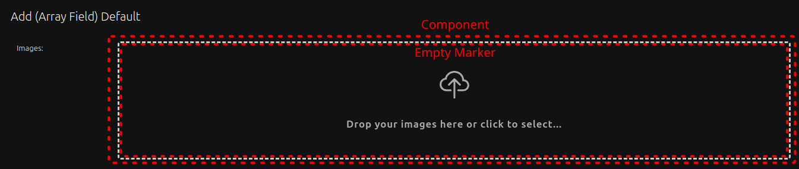
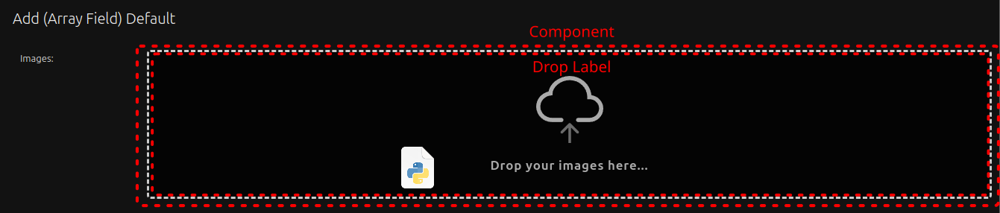
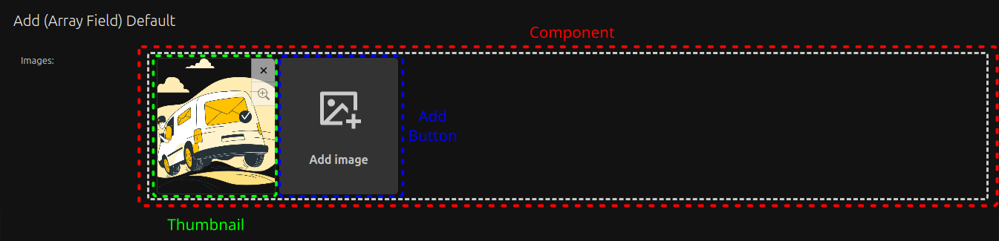

# ADR 0007: Name conventions

| :date: {: .adr-emoji }         | May 2025. {: .adr-text}                                      |
| :----------------------------: | :-------------------------------------------------------------- |
| :writing_hand: {: .adr-emoji } | [Eduardo Oliveira](https://github.com/EduardoJM) {: .adr-text } |

## Context

To maintain consistency between our texts, code and tests we need to create some name conventions for this package. We use, in images bellow, description images with `ArrayField`, but the names are same for all widgets and for the inline editors.

## Decision

We have two major possible states of the component: empty and filled.

### Empty States

When the component is empty, without any image selected, we have two options: the `empty marker` is displayed, by default. And, if we drag and drop a image inside the component we have a `drop label` visible:

#### Empty Marker

#### Drop Label

### Filled State

When the component is not empty, when we have one or more images on it, we have some new itens:

The reduced image preview is called `thumbnail`. The button to add new images are, obviously, called as `add button`. Inside the thumbnail the button to show `modal` with larger image is called as `preview button` and the button to remove the image is called as `delete button`.
