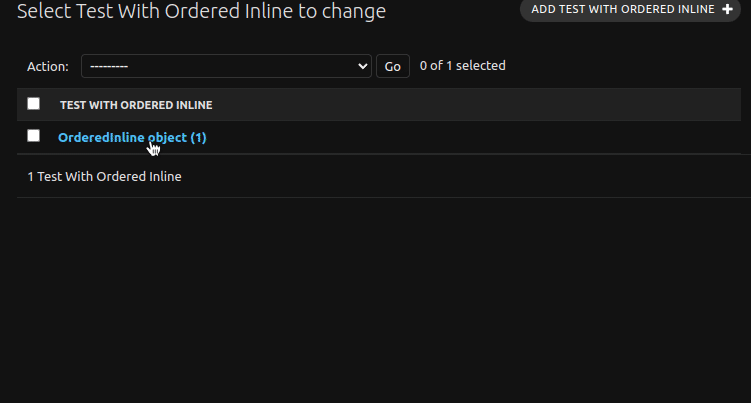

# Getting started

The **django-image-uploader-widget** is a set of **django** widget and **django-admin** inline editor to handle better image uploads with a little bit modern user interface.

<div class="images-container" markdown="block">

{ loading=lazy }

</div>

## Features

- Support required and optional `ImageField`;
- Support for `ImageField` inside inlines of **django-admin**.
- Support preview modal;
- Support custom inline for **django-admin** multiple images uploader.
- Support reordering inside **django-admin** custom inline for multiple uploads.
- Support `ArrayField` for `PostgreSQL` database.
- Support upload by dropping file.
- Out of box HTML support.

## Requirements

- Python 3.8+
- Django 3.2+

## Getting Started

To get started, install this plugin with the pip package manager:

```sh
pip install django-image-uploader-widget
```

then, go to the `settings.py` file and add the `image_uploader_widget` to the installed apps:

```python
INSTALLED_APPS = [
    # ...
    'image_uploader_widget',
    # ...
]
```

## Basic Usage

### With Admin

The `ImageUploaderWidget` is a class that implements a custom widget for single image uploader and can be used inside the `formfield_overrides` attribute inside the `ModelAdmin` class.

```python
# admin.py
from django.contrib import admin
from django.db import models
from image_uploader_widget.widgets import ImageUploaderWidget
from .models import YourModel


@admin.register(YourModel)
class YourModelAdmin(admin.ModelAdmin):
    formfield_overrides = {
        models.ImageField: {'widget': ImageUploaderWidget},
    }
```
See the [documentation](./widget/01-resumed.md) for more complex usage's.


### With ModelForm

The `ImageUploaderWidget` can be used inside the `widgets` Meta attribute of a `Form`/`ModelForm`:

```python
# forms.py
from django import forms
from image_uploader_widget.widgets import ImageUploaderWidget

class ExampleForm(forms.ModelForm):
    class Meta:
        widgets = {
            'image': ImageUploaderWidget(),
        }
        fields = '__all__'
```

See the [documentation](./widget/01-resumed.md) for more complex usage's.

### Custom Inline Admin

The `ImageUploaderInline` is implemented with the base of the `admin.StackedInline` to create an custom django-admin to work with multiple images upload using a model only to store the images:

```python
# models.py

class Product(models.Model):
    # ...

class ProductImage(models.Model):
    product = models.ForeignKey(
        Product,
        related_name="images",
        on_delete=models.CASCADE
    )
    image = models.ImageField("image")
    # ...
```

```python
# admin.py
from django.contrib import admin
from image_uploader_widget.admin import ImageUploaderInline
from .models import Product, ProductImage

class ProductImageAdmin(ImageUploaderInline):
    model = ProductImage

@admin.register(Product)
class ProductAdmin(admin.ModelAdmin):
    inlines = [ProductImageAdmin]
```

See the [documentation](./inline_admin/01-tutorial.md) for more complex usage's.

### Array Field

The ArrayField support is made by a custom field, called `ImageListField`. Then, to use it, we need to change the field from default `ArrayField` to `ImageListField`. The reason for it is: the default `ArrayField` with `ImageField` not works and some part of the behaviour of the `ImageField` is implemented inside the `ImageListField`.

```python
# models.py
from django.db import models
from image_uploader_widget.postgres import ImageListField

class TestWithArrayField(models.Model):
    images = ImageListField(blank=True, null=True, upload_to="admin_test")

    class Meta:
        verbose_name = "Test With Array Field"
```

See the [documentation](./array_field/01-tutorial.md) for more complex usage's.


## Preview

Bellow we have some preview screenshots for the widget and inline admin editor.

### Dark Theme

Preview of the widget in dark theme.

<div class="images-container" markdown="block">


</div>

<div class="images-container" markdown="block">


</div>

### Light Theme

Preview of the widget in light theme.

<div class="images-container" markdown="block">


</div>

<div class="images-container" markdown="block">


</div>

## Behaviour

Preview of the behaviour of the widget and inlines.

<div class="images-container" markdown="block">


</div>

<div class="images-container" markdown="block">


</div>
