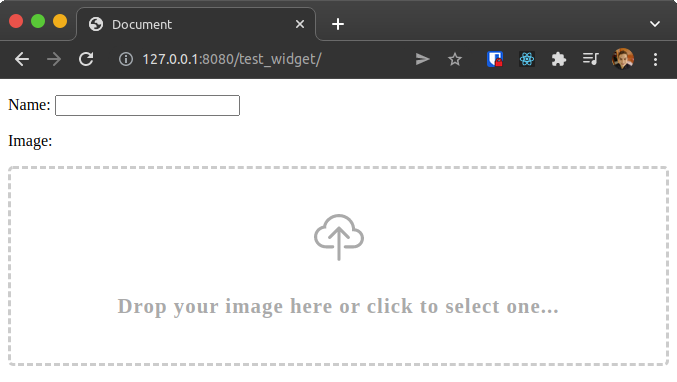

# Getting Started

If you want to read a more complete description of how to use this widget, see the [Tutorial](./02-tutorial.md). But, if you is an advanced user, only install the package:

```bash
pip install django-image-uploader-widget
```

!!! warning "Version Information"

    On the `1.0.0` release of this package we droped the support for `Django 3.2`, `Django 4.0` and `Django 4.1`. We, currently, maintain the support for `Django 4.2` (LTS), `Django 5.0` and `Django 5.1`. Then, if you are using `Django 3.2`, `4.0` or `4.1`, installs `0.7.1` version:

    ```bash
    pip install django-image-uploader-widget==0.7.1
    ```

and add the `image_uploader_widget` to the `INSTALLED_APPS` in the `settings.py`:

```python
# ...

INSTALLED_APPS = [
    'django.contrib.admin',
    'django.contrib.auth',
    'django.contrib.contenttypes',
    'django.contrib.sessions',
    'django.contrib.messages',
    'django.contrib.staticfiles',
    'image_uploader_widget',
]

# ...
```

And go to use it with your forms:


```python
from django.forms import ModelForm
from ecommerce.models import Product
from image_uploader_widget.widgets import ImageUploaderWidget

class ProductForm(ModelForm):
    class Meta:
        model = Product
        fields = ['name', 'image']
        widgets = {
            'image': ImageUploaderWidget()
        }
```

<div class="images-container" markdown="block">

{ loading=lazy }

</div>
